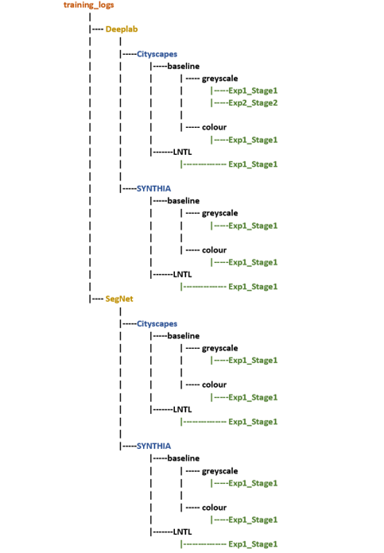
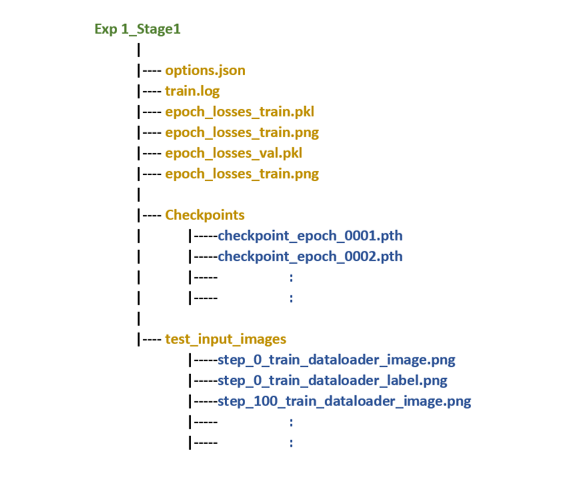
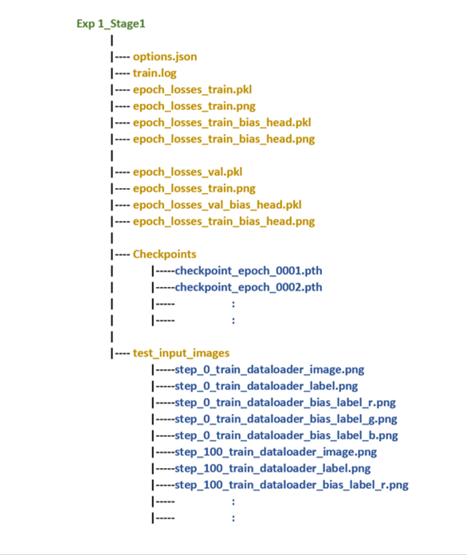

# Welcome to the training_logs directory!

### File Structure:

The training_logs directory documents each experiment the file structure is as follows:

When a model is ran these directories are automatically created saving experiments in a systematic way for the different models and datasets. This method allows for scalability with both extra datsets and new networks, the experiment subdirectories have the following strucutre:

### Baseline models

 

### LNTL Scheme

 

